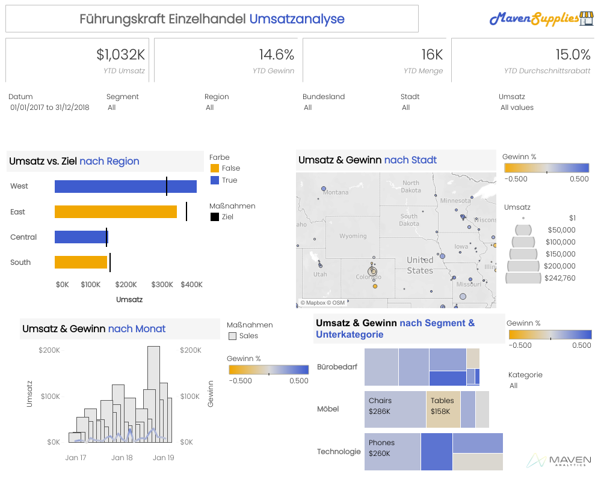
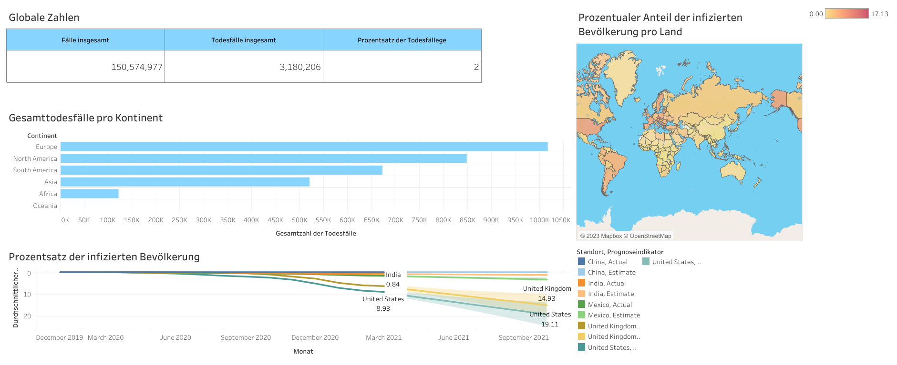
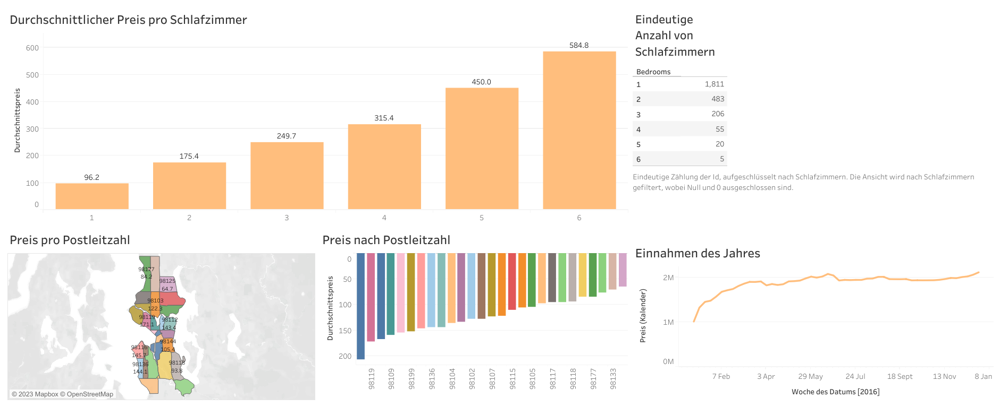
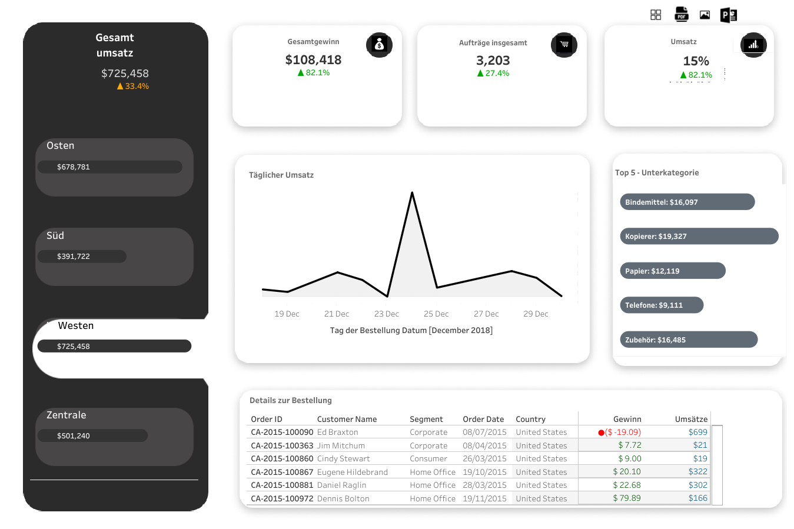

# Projekt 1 - Analyse der Daten von Maven Supplies
## •	Geschäftsproblem und Kontext
Sie wurden gerade von Maven Supplies eingestellt, einem innovativen Büroartikelgeschäft, das Kopierpapier und Haftnotizen wieder zum Leben erwecken möchte. Ihre Aufgabe ist es, eine Business-Intelligence-Lösung für die Geschäftsleitung von Grund auf zu entwerfen und aufzubauen.
Ihr Kunde benötigt eine Möglichkeit, um KPIs wie Umsatz, Gewinneinheiten und Rückgaben zu verfolgen. Er muss die Leistung auf seinen verschiedenen Märkten vergleichen, die Rentabilität von Kategorien und Unterkategorien analysieren und Kunden mit hohem Wert identifizieren.
Der Knackpunkt ist, dass Sie nur einen Ordner voller Excel-Dateien mit Informationen über Bestellungen, Retouren, Produkte, Kunden und Gebiete enthalten.

## •	Ziel erreicht: 
Erstellung eines vollständigen KPI-Dashboards auf Produktionsebene mit Tableau Desktop, ausgehend von einer Verbindung zu einigen wenigen Excel-Dateien. Die wichtigsten Funktionen wurden erstellt, um den Führungskräften von Maven Supplies die Möglichkeit zu geben, ihre Analysen zu vertiefen und fundierte Geschäftsentscheidungen zu treffen.

## • Die wichtigsten Schritte wurden befolgt:
1.	Verwendung von Tableau Desktop zur Verbindung und Umwandlung von Rohdaten.
2.	Anwendung von Sortier- und Filterwerkzeugen auf die verschiedenen Analysen.
3.	Erstellung von benutzerdefinierten Berechnungen und Parametern, um Ihre Analysen dynamisch zu gestalten und interaktive Berichte und beeindruckende Dashboards zu entwerfen.

## •	Wichtige Einblicke aus dem Dashboard:
1.	Am oberen Rand des Dashboards ermöglichen dynamische Filteroptionen den Führungskräften, genau die richtigen Datenpunkte zu finden, um die wichtigsten Bereiche ihres Unternehmens zu analysieren.
2.	Am oberen Rand des Dashboards werden übergeordnete Trendmetriken angezeigt, die einen Einblick in die regionale Umsatz- und Zielleistung ermöglichen.
3.	Wenn man auf bestimmte Regionen klickt, kann man die räumliche Verteilung nach Städten sehen.
4.	Es ist möglich, durch Klicken auf jede Stadt eine weitere Aufschlüsselung nach Segmenten und Unterkategorien mithilfe von Tableau Treemaps zu erhalten.
5.	Nach der Auswahl eines Segments und einer Unterkategorie können Sie die Umsatz- und Gewinntrends von Monat zu Monat sehen, um bestimmte Bereiche von Interesse zu untersuchen.
6.	Alle im Dashboard angezeigten Analysen werden durch benutzerdefinierte Berechnungen, Parameter, dynamische Sets, benutzerdefinierte Bilder und die Möglichkeit, dieses Dashboard außerhalb des Tools zu exportieren und an den Rest des Unternehmens zu verteilen, unterstützt.

## •	Ergebnis und Schlussfolgerung aus dem Dashboard:
1. Dieses dynamische Dashboard zeigt die Verkaufsanalyse des Maven Supplies-Datensatzes. 
2. Hier beträgt der Gesamtumsatz 1032 $, während die Gewinnspanne 14,6% beträgt, die Gesamtbestellungen 16 >K für alle Jahre und ein Durchschnittsrabatt von 15%.
3. Die Filter Datum, Segment, Region, Bundesland, Stadt und Umsatz helfen beim Filtern der Diagramme, um bessere Ergebnisse zu erzielen.
4. Im Diagramm Umsatz vs. Ziel nach Region wurde der Umsatz als Balken und das Ziel als Gantt-Liniendiagramm dargestellt. In der westlichen und zentralen Region war der Umsatz höher als das Ziel.
5. Das Kartendiagramm zeigt Umsatz und Gewinn nach Städten. Gewinn % zeigt den Bereich des Gewinns von -50% bis +50%. 
Tooltip zeigt die Verkäufe und den prozentualen Anteil der Verkäufe in den einzelnen Bundesstaaten, z. B. hat New York City 89,4 % der Verkäufe im Bundesstaat New York.
6. Das Balken- und Liniendiagramm zeigt den Vergleich von Umsatz und Gewinn nach Monat. Der Balken zeigt den Umsatz, die Linie den Gewinn. September 18 hat den höchsten Umsatz von 209.000 $ und einen Gewinn von 31.000 $.
7. Treemap zeigt die Umsätze und Gewinne nach Segmenten und Kategorien. Die Farben werden entsprechend dem prozentualen Gewinn im Bereich von -50% bis 50% angezeigt.

## •	Verwendete technische Tools: 
MS Excel, Tableau Public.

## •	Verwendete Techniken/Fähigkeiten:
Excel, Tableau, Datenvisualisierung.

### Übersicht über das Dashboard

# Projekt 2 - Analyse der Covid-Daten  
## •	Geschäftsproblem und -kontext: 
Entwickeln Sie eine Datenbank in SQL, indem Sie eine Datenexploration der Covid-Daten durchführen und dann ein Dashboard mit Tableau erstellen. Das Dashboard soll die globale Anzahl der Fälle, die Todesfälle und deren Verhältnis, den Prozentsatz der infizierten Bevölkerung, eine Karte mit der infizierten Bevölkerung pro Land und die Gesamtanzahl der Todesfälle pro Kontinent zeigen.  

## •	Datenquelle:
Covid-Daten von Februar 2020 bis August 2021.

## •	Abgeleitete Schlüsselerkenntnisse:
1.	Die globale Zahl zeigt die Gesamtanzahl der Fälle, die Gesamtanzahl der Todesfälle und den Prozentsatz der Todesfälle.
2.	Das Liniendiagramm zeigt den durchschnittlichen Prozentsatz der infizierten Bevölkerung in Bezug auf Monat und Land.
3.	Das Balkendiagramm zeigt den Vergleich der Gesamttodesfälle nach Kontinent. 
4.	Der Prozentsatz der infizierten Bevölkerung pro Land kann aus der Karte abgelesen werden.

## •	Ergebnis und Schlussfolgerung aus dem Dashboard:
1.	Die Gesamtzahl der Fälle belief sich auf 150.574.977, während die Gesamtzahl der Todesfälle 3.180.206 betrug und der Prozentsatz der Todesfälle weltweit bei 2 % lag.
2.	Das Liniendiagramm zeigt, dass im August 2021 die USA mit durchschnittlich 19,11 % den höchsten Prozentsatz der infizierten Bevölkerung aufwiesen, während China mit 0,01 % den niedrigsten Prozentsatz aufwies.
3.	Das Balkendiagramm zeigt, dass die Gesamtzahl der Todesfälle pro Kontinent in Europa am höchsten war und einen Wert von 1.016.750 hatte.

## •	Wichtige Schritte im Projekt:
1. Erstellen einer Datenbank 
2. Analyse und Abruf von Daten mit SQL (Entwicklung einer SQL-Abfrage) 
3. Tableau mit einer Datenbank verbinden 
4. Daten in Tableau visualisieren 
5. Unsere Ergebnisse zusammenfassen

## •	Verwendete technische Tools: 
SQL Server Management Studio, Tableau Public.

## •	Verwendete Techniken/Fähigkeiten:
SQL Server, Tableau, Datenvisualisierung.

### Übersicht über das Dashboard

# Projekt 3 - Analyse der Airbnb-Daten  
## •	Geschäftsproblem und -kontext: 
Entwickeln Sie eine Datenbank zur Analyse und Visualisierung von Airbnb-Daten und erstellen Sie dann mit Tableau ein Dashboard, das Sie Ihren Stakeholdern präsentieren können. Das Dashboard sollte die Trends Durchschnittlicher Tagessatz pro Zimmer, Preis pro Postleitzahl, Jahreseinkommen und Anzahl der Zimmer anzeigen.

## •	Datenquelle:
Airbnb-Daten für 2016

## •	Abgeleitete Schlüsselerkenntnisse:
1.	Trends Durchschnittliche Tagespreise pro Zimmer, Preis pro Postleitzahl, Jahreseinkommen und Anzahl der Zimmer helfen, einen Überblick über die Hoteldaten zu erhalten.
2.	Ein Liniendiagramm hilft, die Einnahmen für eine bestimmte Woche zu vergleichen.
3.	Das Balkendiagramm zeigt den Unterschied im Durchschnittspreis je nach Anzahl der Zimmer. 

## •	Ergebnis und Schlussfolgerung aus dem Dashboard:
1.	Der Durchschnittspreis ist am niedrigsten für Häuser mit 4 Schlafzimmern und am höchsten für Häuser mit einem oder sechs Schlafzimmern.
2.	Das Einkommen steigt mit der Woche. 
3.	Die meisten Häuser haben nur ein Schlafzimmer, während die Anzahl der Schlafzimmer mit zunehmender Anzahl der Häuser abnimmt.

## •	Verwendete technische Hilfsmittel: 
MS Excel, Tableau Public.

## •	Verwendete Techniken/Fähigkeiten:
Excel, Tableau, Datenvisualisierung.

### Übersicht über das Dashboard

# Projekt 4 - Analyse der Umsatzdaten  
## •	Geschäftsproblem und -kontext: 
Bereinigung des Superstore-Datensatzes, der in csv-Dateien vorliegt. Erstellen Sie ein Dashboard aus diesen Daten mit Tableau Public, um KPIs wie Umsatz, Gesamtbestellungen, Gesamtgewinn zu verfolgen, den Umsatz nach Bestelldatum zu vergleichen, Kunden mit hohem Wert und Trends auf Kategorieebene zu analysieren.

## •	Datenquelle:
Superstore-Datenbank

## •	Wichtige Einblicke aus dem Dashboard: 
1. KPIs helfen bei der Verfolgung des Umsatzes, der Menge der verkauften Artikel und des Gesamtgewinns.
3. Tägliche Verkaufszahlen zeigen die Region mit den höchsten täglichen Verkaufszahlen, die bei Bedarf zur Verbesserung unseres Geschäfts beitragen können.
4. Das Liniendiagramm vergleicht die Verkäufe nach Bestelldatum.
5. Top-5-Unterkategorien-Diagramm zeigt die 5 Unterkategorien mit den höchsten Umsätzen. 

## •	Ergebnis und Schlussfolgerung aus dem Dashboard:
1.	Der Gesamtverkauf hatte einen Wert von $725.458, während der Gesamtgewinn einen Wert von $ 108.418 und 3.203 Gesamtbestellungen hatte.  
2.	Die Region West hatte den höchsten Verkauf im Wert von $ 725,45, während der Süden den niedrigsten Verkauf im Wert von $ 391,72 unter den 4 Regionen hatte. 
3.	Der höchste Umsatz wurde zwischen dem 23. und 25. Dezember während der Weihnachtszeit erzielt.  
4.	Von allen Unterkategorien hatten Kopierer den höchsten Verkaufspreis von $ 19,32, während Telefon den niedrigsten Preis von $ 9,1 hatte. 

## •	Verwendete technische Tools: 
Tableau Public, MS Excel.

## •	Verwendete Techniken/Fähigkeiten:
Tableau, Excel

### Übersicht über das Dashboard

